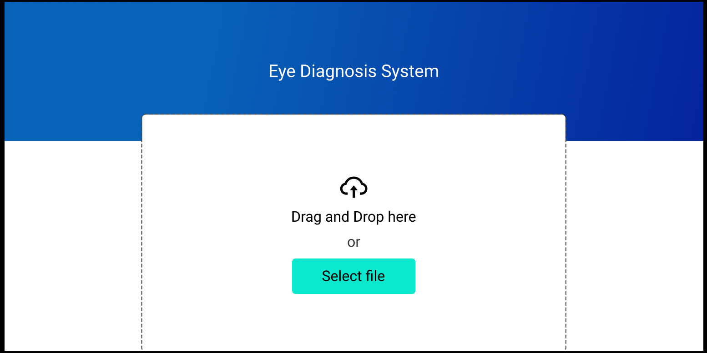

# Eye Diagnostic System



The Eye Diagnostic System is a web application developed using Django and Python that utilizes deep learning techniques to diagnose eye conditions. It provides an intuitive interface for users to upload eye images and obtain predictions on potential eye diseases. This repository contains the source code and resources for the Eye Diagnostic System.

## Features

- Upload eye images for diagnosis
- Utilizes deep learning models for accurate predictions
- Provides diagnostic results for various eye conditions
- User-friendly interface for easy interaction
- Detailed documentation for developers

## Installation

1. Clone the repository:

```bash
git clone https://github.com/haris-bit/EyeDiagnosticSystem-FYP.git
```


## Change to the project directory:
```bash
cd EyeDiagnosticSystem-FYP
```

## Install the required dependencies:
```bash
pip install -r requirements.txt
```

## Start the Django development server:
```bash
python manage.py runserver
```

Access the web application by visiting http://localhost:8000 in your browser.

# Usage

- Register a new account or log in to an existing account.
- Upload an eye image for diagnosis.
- Wait for the system to process the image and generate predictions.
- View the diagnostic results for potential eye conditions.

# Folder Structure
The repository has the following structure:

```bash
├───config
├───core
│   ├───models
│   ├───services
│   └───utils
├───diagnosis
│   ├───migrations
│   └───templates
├───media
│   └───uploads
└───static
    ├───css
    ├───img
    └───js
```

- The config folder contains configuration files for the Django project.
- The core folder contains the core application logic, including models, services, and utility functions.
- The diagnosis folder contains the Django app responsible for handling diagnosis requests and rendering templates.
- The media/uploads folder is used to store user-uploaded eye images.
- The static folder contains static files such as CSS, images, and JavaScript.

# Contributing
Contributions to the Eye Diagnostic System are welcome! If you find any bugs or have suggestions for new features, please open an issue or submit a pull request. Make sure to follow the code of conduct when contributing.

# License
This project is licensed under the MIT License.

# Acknowledgements

- Django - Python web framework
- PyTorch - Deep learning library
- Bootstrap - CSS framework
- OpenCV - Computer vision library

# Contact

For any inquiries or questions, please contact the project owner:

Team Lead: Haris Iftikhar
Members: Waleed Mustafa and Muhammad Umar
Email: harisiftikhar109@gmail.com
Feel free to reach out for support or collaboration opportunities.